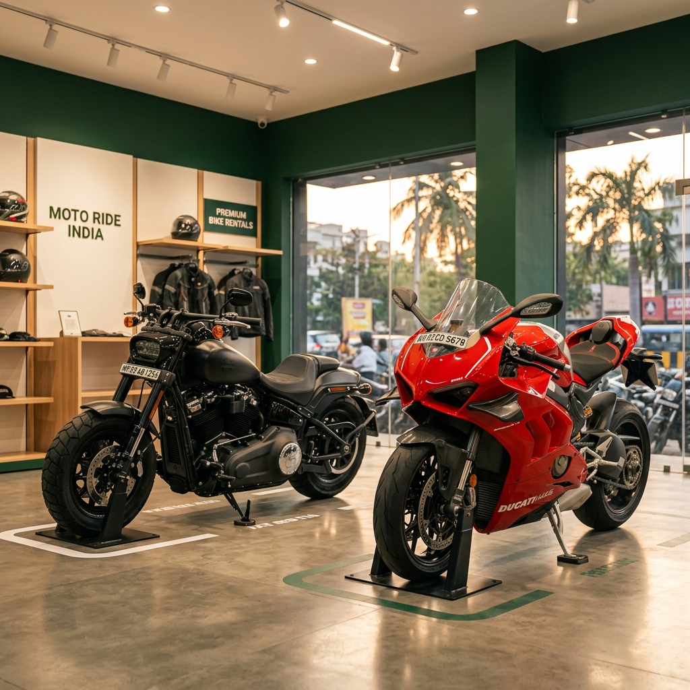
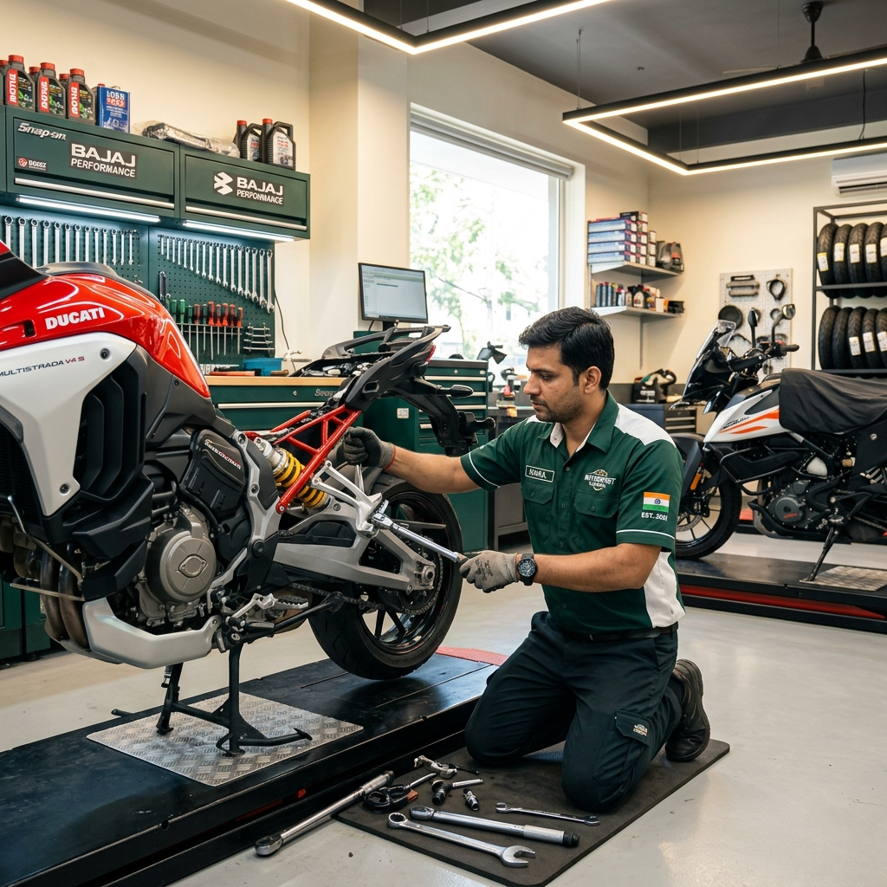
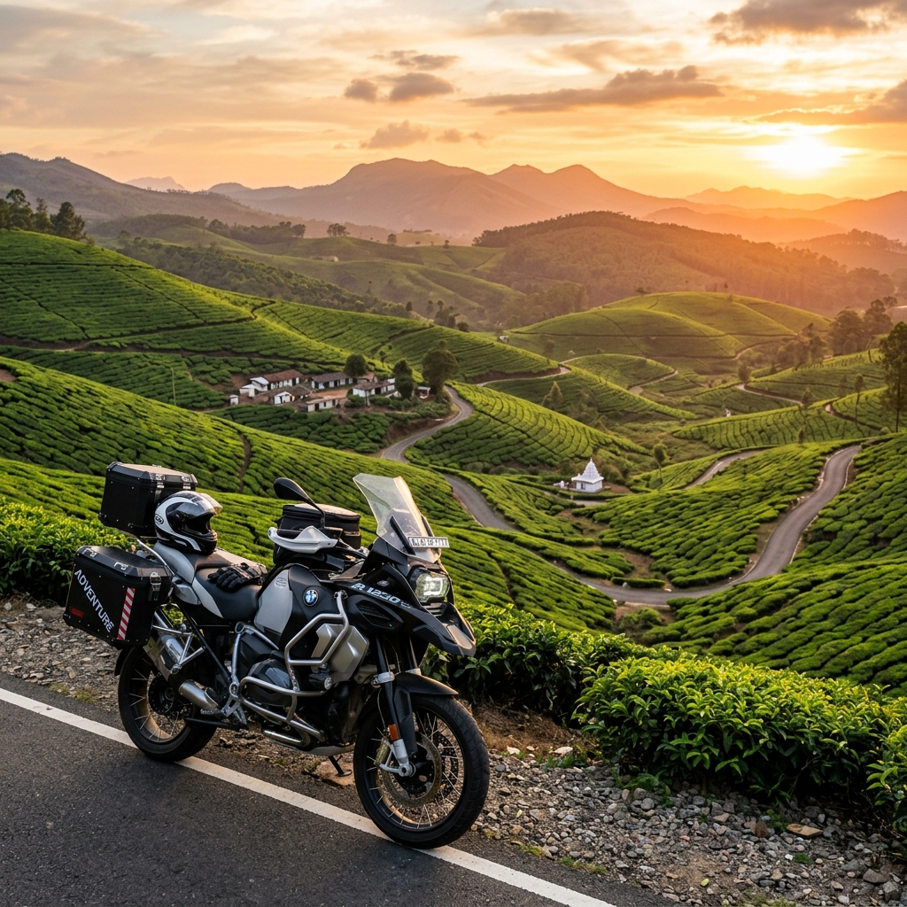

# VegaRide (VR) 🛵

VegaRide helps riders find, book, and pre-book premium **two-wheeler rentals, garage servicing, and roadside emergency mechanics** anywhere in India. 

The application is built strictly using **pure Java (OOPs) for the backend, and pure HTML, CSS, and basic JavaScript for the frontend**. There are zero complex enterprise frameworks or databases required, and it works with 100% pinpoint accuracy without using any restricted, paid API keys.

---

## 📸 Core Brand Showcases (Slide Gallery)

VegaRide features an automatic cross-fading showcase carousel on the welcome screen. Here are the custom, high-resolution assets generated specifically for the platform:

### 1. Two-Wheeler Rental Fleets
*Discover local scooter rental fleets, premium retro Vespas, and long-ride adventure cruisers.*



### 2. Verified Roadside Repair Garages
*Quick puncture clinics, spark plug diagnostics, battery jumpstarts, and heavy-duty towing recovery.*



### 3. Winding Scenic Roads (Freedom to Travel)
*Plan ahead and pre-book scheduled servicing or rentals for holiday trips across the national highways of India.*



---

## 🌟 Premium Features

### 1. **Visual Splash Loading Screen (VR Monogram)**
On booting up, a gorgeous dark forest-green welcome page displays a custom monogram **"VR"** that zooms in and fades out smoothly before launching you into the interactive portal.

### 2. **Pinpoint Accurate Locality GPS (No API Keys Required)**
Clicking **Auto Detect** leverages the browser's native **HTML5 Geolocation** coordinates, reverse-geocoding them instantly using OpenStreetMap's open Nominatim geocoding engine. It reads your pinpoint suburb/neighborhood name (like *Koramangala, Indiranagar, or Bandra*) and loads local providers without needing any paid Google Maps API keys.

### 3. **Strict 1.5 KM Distance Limit**
All mechanic clinics, towing trucks, and rental depots are guaranteed to be within a **1.5 km radius** of your coordinates (ranging between `0.2 km` and `1.5 km` max) so they are within walking distance or a 2-minute ride.

### 4. **Uber & Ola-Inspired Ride Categories**
We support various curated fleets to suit your daily budget:
* ⚡ **VR Eco-Electric:** Smart, eco-friendly mopeds perfect for quick, green city hops. Starts at *₹15/hr*.
* 🛵 **VR Mini Commuter:** Easy-to-ride gearless scooters (e.g., Activa, Access). Starts at *₹20/hr*.
* 🏍️ **VR Royal Cruiser:** Comfortable classic touring motorcycles (e.g., Bullet, Himalayan). Starts at *₹40/hr*.
* 🔥 **VR High-Octane Sport:** Aggressive performance sports bikes (e.g., KTM, Yamaha). Starts at *₹60/hr*.

---

## 🚦 Simple Startup Instructions

Since VegaRide uses **only standard libraries**, it compiles and boots in seconds.

### Prerequisites
* Java JDK installed (Java 8 or higher).

### Steps to Run
1. Open your terminal inside the project root folder.
2. Compile the Java files:
   ```bash
   javac -d bin -sourcepath src src/com/vegaride/Main.java
   ```
3. Run the server:
   ```bash
   java -cp bin com.vegaride.Main
   ```
4. Access the portal in your browser:  
   👉 **[http://localhost:8080](http://localhost:8080)**
